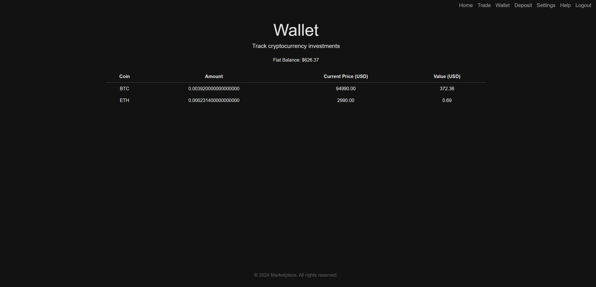
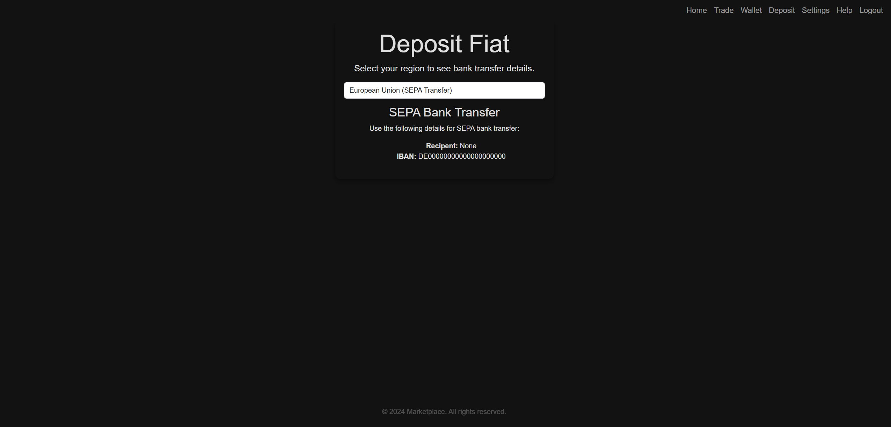

# Crypto Marketplace

- This platform simulates a crypto marketplace environment, allowing users to explore features such as buying and selling crypto, viewing market data, and managing wallets. 
- **Note**: This is not an actual exchange and does not involve real transactions. It is intended as a development prototype for educational and demonstration purposes.

## Features
- Cryptocurrency buying and selling functionality
- Dashboard displaying current market data
- Wallet interface showing coins and their values
- Database storage for coins and related data
- Database storage for users and their information
- Integration with MariaDB for persistent data management
- Using OAuth2 to log in with a Google Account
- Notification system to message the support
- Secure password hashing (Argon2id) 
- Password reset functionality for users
- Secure authentication (2FA via Authenticator App not yet implemented) 






## Prerequisites
- Python 3.12+
- MariaDB
- `pip`

## Setting up Environment Variables
Set your DB Configuration in a `.env` file in root directory

```env
USER_DB_NAME=marketplace_users
USER_DB_USER=""
USER_DB_PASSWORD=""
USER_DB_HOST=localhost
USER_DB_PORT=3306

COIN_DB_NAME=marketplace_coins
COIN_DB_USER=""
COIN_DB_PASSWORD=""
COIN_DB_HOST=localhost
COIN_DB_PORT=3306

WALLET_DB_NAME=marketplace_wallets
WALLET_DB_USER=""
WALLET_DB_PASSWORD=""
WALLET_DB_HOST=localhost
WALLET_DB_PORT=3306

MARIADB_ROOT_PASSWORD=""
```
To use certain features, you'll need to add the following to the `.env` file : 

```bash
# Google OAuth credentials
GOOGLE_CLIENT_ID=your_client_id
GOOGLE_CLIENT_SECRET=your_client_secret

# Gmail credentials for sending emails
GMAIL_ADDRESS=your_gmail_address
GMAIL_PASSWORD=your_gmail_password

# Email address user sends support messages to
SUPPORT_EMAIL=your_email_address

# Secret key for URLSafeTimedSerializer
URLSafeTimedSerializer_SECRET_KEY=your_urlsafetimedserializer_secret_key

# Secret Key for the Flask App
APP_SECRET_KEY=your_secret_key

```

## Setting up OAuth2 with Google

- https://support.google.com/cloud/answer/6158849?hl=en#zippy=

- https://developers.google.com/identity/protocols/oauth2/web-server

Authorized redirect URIs needed for OAuth2:

- http://localhost:5000/login
- http://localhost:5000/authorize
- http://127.0.0.1:5000/authorize


## Installation

You can set up the **Marketplace** in two ways: using **Git** or **Docker**.

## How to Use with Git

### 1. Clone the Repository

```bash
git clone https://github.com/lllDavid/marketplace.git
```

### 2. Install dependencies

**Navigate to the directory:**
```bash
cd marketplace
```

**Create a virtual environment:**
```bash
python -m venv venv
```


**Activate the virtual environment:**
```bash
.\venv\Scripts\activate
```


**Install requirements:**
```bash
pip install -r requirements.txt
```


### 3. Set up MariaDB

**Download and install MariaDB from their official site:**
    [MariaDB](https://mariadb.com/downloads/)


### 4. Connect to Database

**Run HeidiSQL (installed with MariaDB) and create a new session**.

### 5. Create the tables

**After entering the session in HeidiSQL,** use the **Query Tab** to execute the SQL scripts located in `marketplace/app/db`.

### 6. Run the Application

```bash
python run.py
```

### 7. This will start the App at: [http://127.0.0.1:5000](http://127.0.0.1:5000)

## How to Use with Docker

#### Prerequisites
- [Docker Desktop](https://www.docker.com/products/docker-desktop/)

### 1. Clone the Repository

```bash
git clone https://github.com/lllDavid/marketplace.git
```
### 2. **Navigate to the directory:**
```bash
cd marketplace
```
### 3. Build and run the Container

```bash
docker-compose up 
```
### This will start the App at: [http://127.0.0.1:5000](http://127.0.0.1:5000)